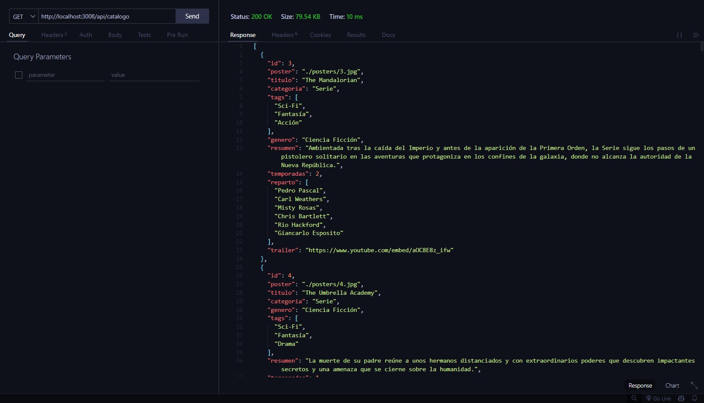
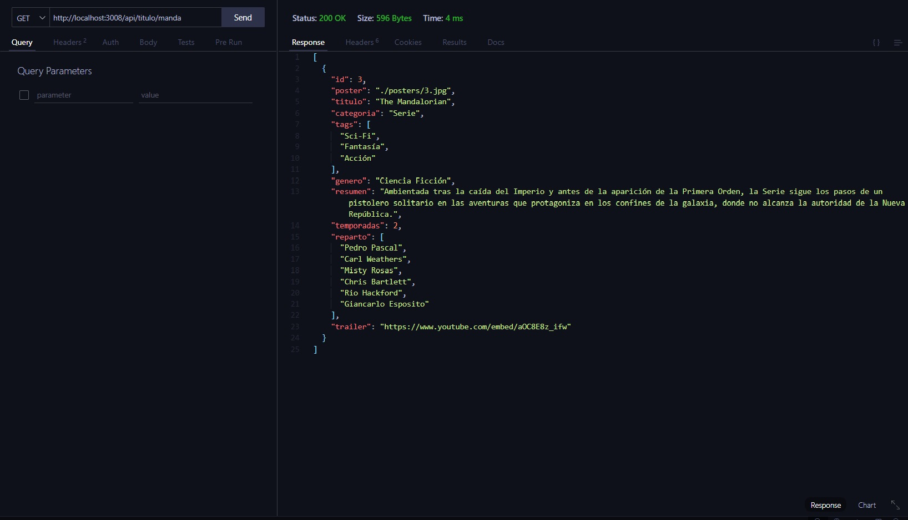
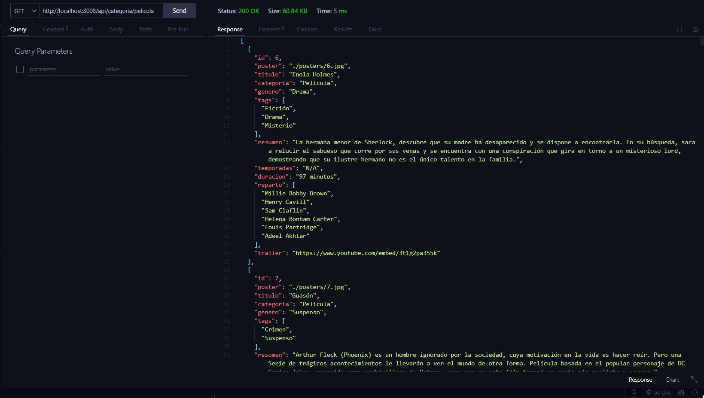
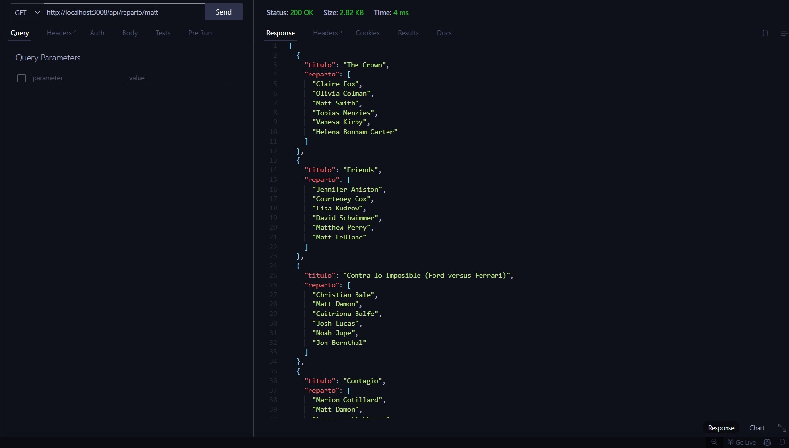
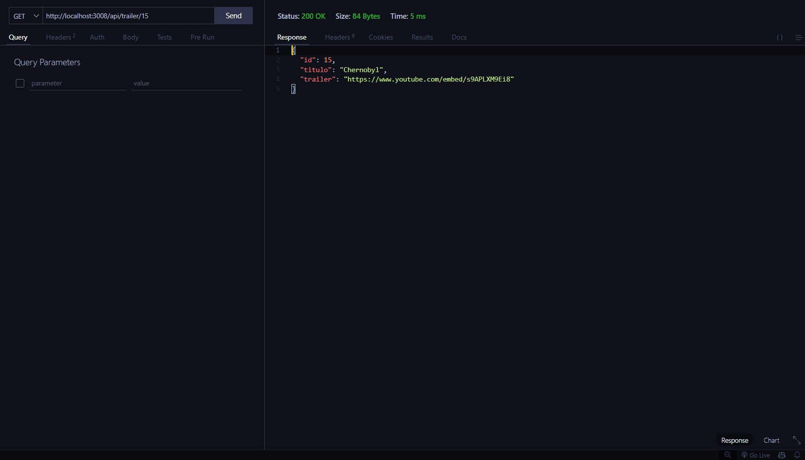

<h1 align="center">🗿 Proyecto: TrailerFlix</h1>

&nbsp;

<h3 align="center"> 💻 Éste es nuestro 1er proyecto: TrailerFlix</h3>

&nbsp;

👩‍💻 Hecho en grupo, por las alumnas:

`GitHub profiles ↓`

<ul>
        <li><a href="https://github.com/amarantaVC" target="_blank">Amaranta Villegas</a></li>
        <li><a href="https://github.com/dxniela" target="_blank">Daniela Ramírez</a></li>
        <li><a href="https://github.com/Roci16" target="_blank">Rocio Ibañez</a></li>
        <li><a href="https://github.com/silfigue" target="_blank">Silvina Figueroa</a></li>
</ul>

💜 Lo hicimos en conjunto, sumando todos nuestros conocimientos aprendidos. Cada compañera trabajando en una o varias branches. Incluyendo llamadas grupales, para corregir y trabajar en conjunto, solucionando problemas, compartiendo otras maneras de hacer el código. Y finalmente, sumar todas las ramas y formar el proyecto finalizado!

&nbsp;

---

&nbsp;

 <h2 align="center"> 📝 Contenidos </h2>

- [x] Debe respetar la estructura básica de un servidor web utilizando Express JS
- [x] Debe incluir el archivo .ENV
- [x] Debe incluir contenido en formato texto de bienvenida para la ruta raíz del proyecto

&nbsp;

🎛 Endpoints:

- [x] /catalogo
- [x] /titulo/:title
- [x] /categoria/:cat
- [x] /reparto/:act
- [x] /trailer/:id

&nbsp;

<h2 align="center">📝 Descripción de Endpoints</h2>

<h3>Endpoint <code>/api/catalogo</code></h3>

Este endpoint devuelve una lista de todo el contenido disponible en el catálogo.

Para probar este endpoint en el navegador, usa la siguiente ruta:

<pre><code>http://localhost:3008/api/catalogo</code></pre>

<h3>Endpoint <code>/api/titulo/:title</code></h3>

Este endpoint devuelve una lista de películas y/o series que se aproximan al título enviado como parámetro. Realiza una búsqueda parcial, lo que significa que encuentra coincidencias incluso si solo se proporciona parte del título.

Para probar este endpoint en el navegador, usa la siguiente ruta, reemplazando <code>:title</code> por el título que deseas buscar:

<pre><code>http://localhost:3008/api/titulo/:title</code></pre>

<h3>Endpoint <code>/api/categoria/:cat</code></h3>

Este endpoint devuelve todo el contenido del catálogo que corresponde a la categoría enviada como parámetro. Las categorías pueden ser "serie" o "película".

Para probar este endpoint en el navegador, usa la siguiente ruta, reemplazando <code>:cat</code> por "serie" o "pelicula":

<pre><code>http://localhost:3008/api/categoria/:cat</code></pre>

<h3>Endpoint <code>/api/reparto/:act</code></h3>

Este endpoint devuelve una lista del catálogo que incluye al actor o actriz indicado por el nombre enviado como parámetro. Realiza una búsqueda parcial del nombre, lo que significa que encuentra coincidencias incluso si solo se proporciona parte del nombre del actor o actriz.

Para probar este endpoint en el navegador, usa la siguiente ruta, reemplazando <code>:act</code> por el nombre del actor o actriz que deseas buscar:

<pre><code>http://localhost:3008/api/reparto/:act</code></pre>

<h3>Endpoint <code>/api/trailer/:id</code></h3>

Este endpoint devuelve la URL del tráiler de la película o serie correspondiente al ID proporcionado como parámetro. Si la película o serie no tiene un video asociado, devuelve un mensaje notificando la no disponibilidad del mismo.

Para probar este endpoint en el navegador, usa la siguiente ruta, reemplazando <code>:id</code> por el ID que deseas buscar:

<pre><code>http://localhost:3008/api/trailer/:id</code></pre>

&nbsp;

 <h2>📄 Instrucciones para Ejecutar el Código</h2>

<ol>
    <li>Clonar el repositorio</li>
    <li>Instalar dependencias:
        <pre><code>npm install</code></pre>
    </li>
    <li>Ejecutar la aplicación:
        <pre><code>npm start</code></pre>
    </li>
</ol>

&nbsp;

---

<h2 align="center">Tecnologías utilizadas:</h2>

&nbsp;

 
  
  
   

&nbsp;

<h2 align="center">Herramientas utilizadas:</h2>

 
  
  

&nbsp;

---

<h2 align="center">📷 Captures de los endpoints:</h2>

A continuación, podrán observar capturas de pantalla de las pruebas realizadas desde la extensión <code>Thunder Client</code> en VSCode de los diferentes endpoints

<h3>Endpoint <code>/api/catalogo</code></h3>

 
  

<h3>Endpoint <code>/api/titulo/:title</code></h3>

 
  

<h3>Endpoint <code>/api/categoria/:cat</code></h3>

  

<h3>Endpoint <code>/api/reparto/:act</code></h3>

  

<h3>Endpoint <code>/api/trailer/:id</code></h3>

  

&nbsp;
