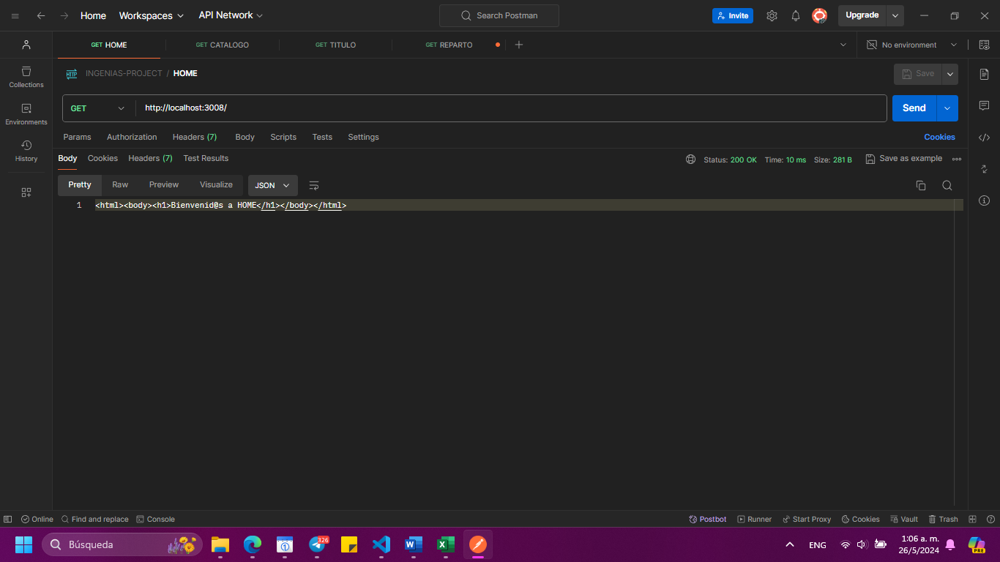
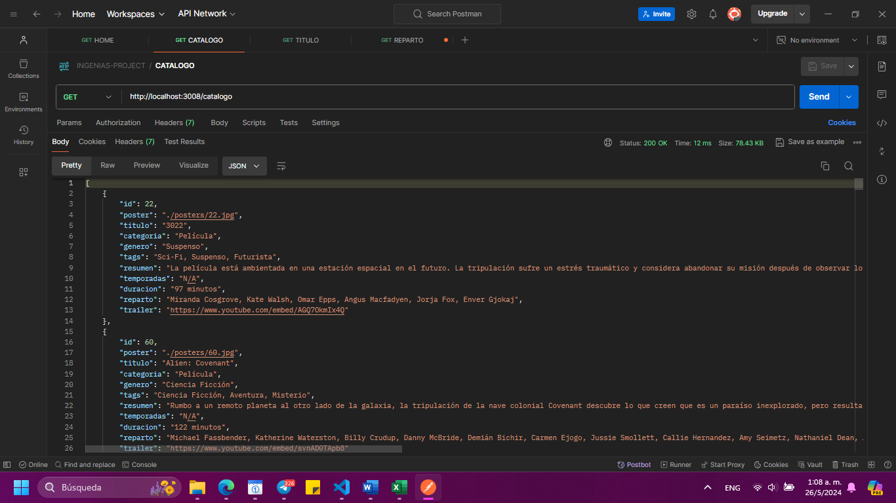
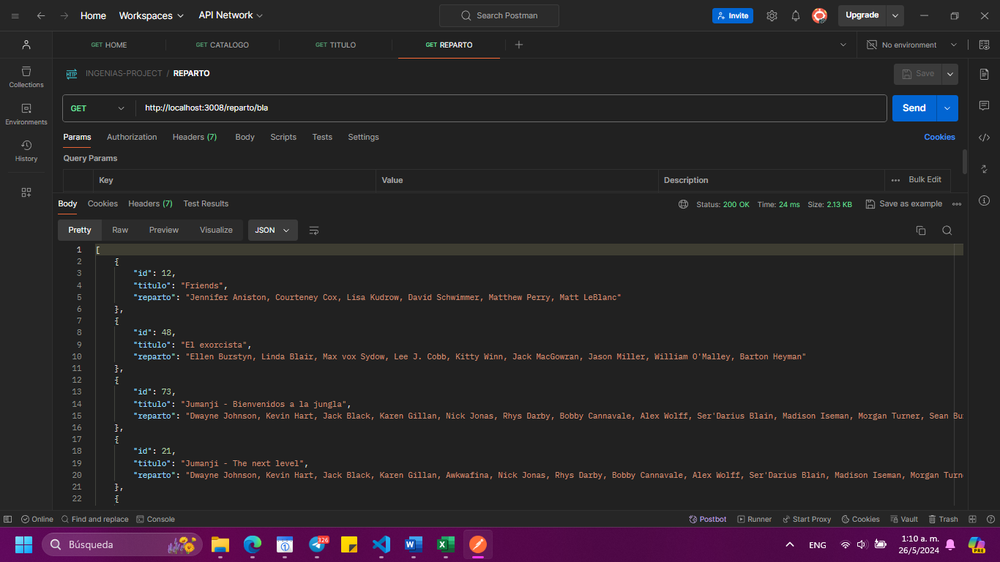

# Entrega del Grupo 6 para la PRE ENTREGA 1:
- Andrea Ayelén Diaz
- Daniela Soto
- Ana Santos
- Magalí Giles

## Organizacion del Repositorio

### Rama para desarrollo
- dev

### Rama para la Entrega Final
-master

## Aplicación con express

Servidor con nodejs + express

### Dependencias instaladas
- Express --> npm i express || npm install express

### Ejecución del programa

En el package.json ver qué scripts existen para ejecutar:
-npm install

```
"scripts": {
    "start": "node --watch index.js",
    "test": "echo \"Error: no test specified\" && exit 1"
}
```

Se podrá ejecutar el proyecto con:
- npm run start

## Evidencias del Funcionamiento de los Endpoints
Endpoint para entrar a Home **"/"**:



Endpoint para obtener todo el catalogo de peliculas y series **“/catalogo”**:



Endpoint para obtener la informacion de una pelicula o una serie segun una categoria **“/categoria/:cat”**:


Endpoint para obtener la informacion de una pelicula o una serie segun su titulo **“/titulo/:titulo”**:


Endpoint para obtener la informacion de una pelicula o una serie segun el reparto **“/reparto/:act”**:



Endpoint para obtener el trailer de una pelicula o una serie segun su id **"/trailer/:id"**;
